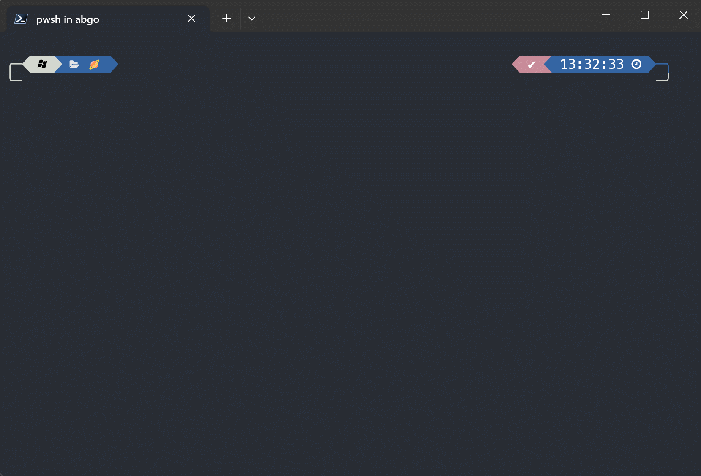
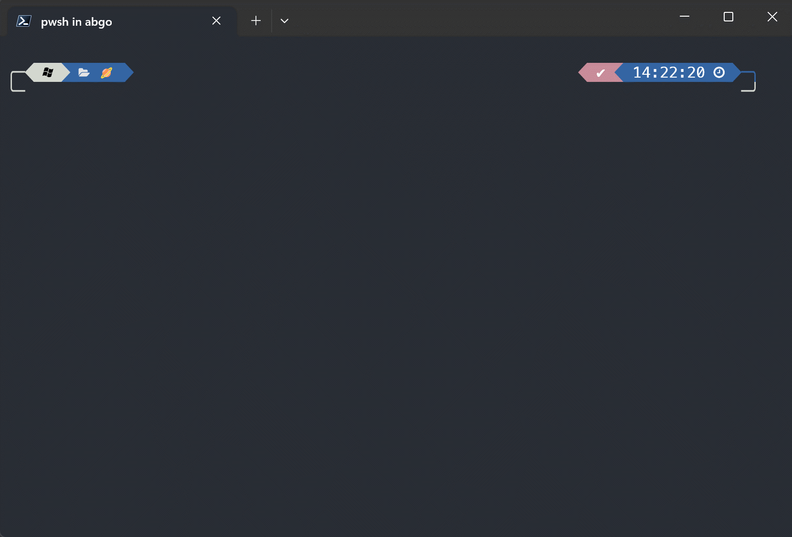

[](https://github.com/ivaquero/scoopet/blob/master/LICENSE)
[](https://img.shields.io/github/languages/code-size/abgox/PS-completions.svg)
[](https://img.shields.io/github/repo-size/abgox/PS-completions.svg)

<p align="left">
<a href="README.md">English</a> |
<a href="README-CN.md">简体中文</a>
</p>

# PowerShell 中的一些命令补全

## 如何使用它们(以 `scoop-tab-completion` 为例)

### 如何去安装

1. 以管理员身份运行`PowerShell`

2. 运行以下代码:

    ```pwsh
    Install-Module scoop-tab-completion
    ```

3. 重启`Powershell`后运行:

    ```pwsh
    Import-Module scoop-tab-completion
    ```

    或者添加到配置文件中:

    ```pwsh
    echo "Import-Module scoop-tab-completion" >> $profile
    ```
    这样就不用每次打开 `Powershell` 引入这个模块


### 如何卸载

1. 以管理员身份运行`PowerShell`.
2. 运行以下代码:

    ```pwsh
    Uninstall-Module scoop-tab-completion
    ```

### 示例



