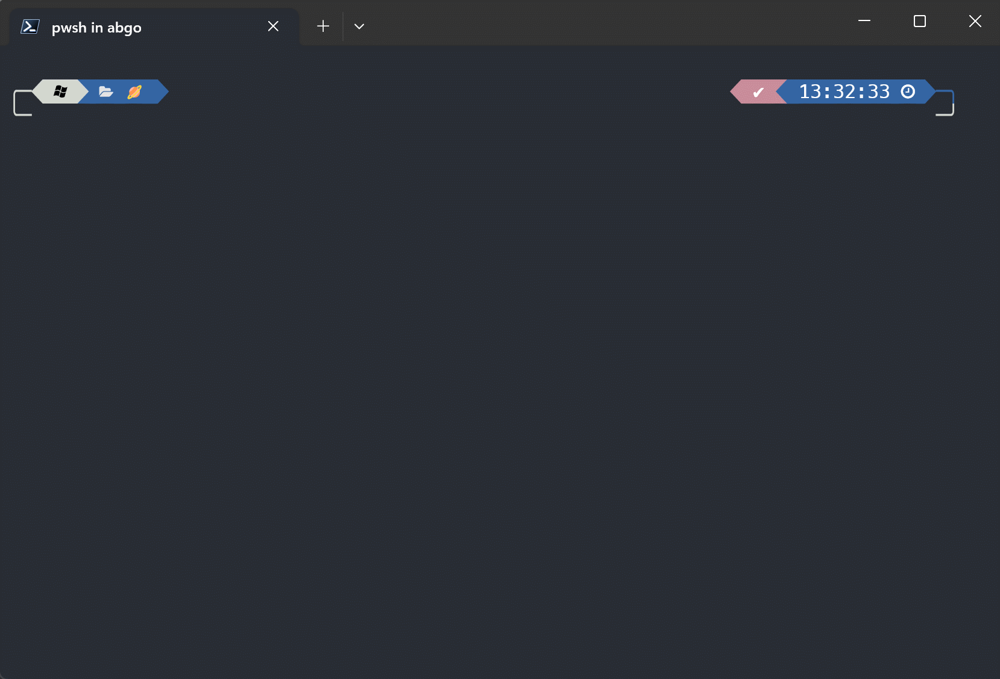
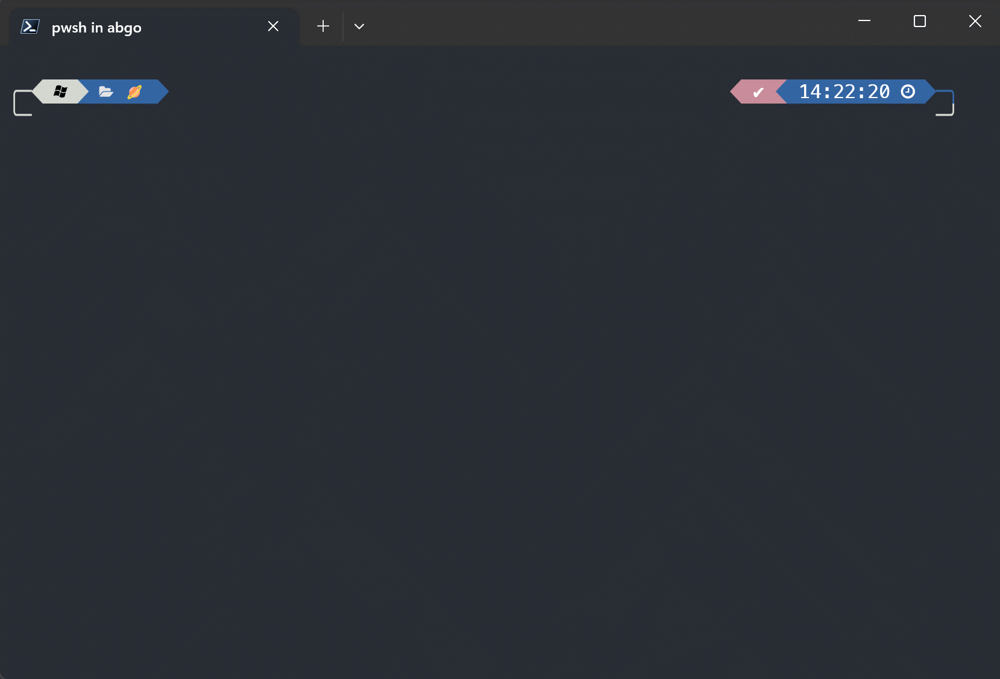

[](https://github.com/ivaquero/scoopet/blob/master/LICENSE)
[](https://img.shields.io/github/languages/code-size/abgox/PS-completions.svg)
[](https://img.shields.io/github/repo-size/abgox/PS-completions.svg)

<p align="left">
<a href="README.md">English</a> |
<a href="README-CN.md">简体中文</a>
</p>

# Some command completion in PowerShell

## Why use it

### Take scoop.ps1 for example

-   Improved command completion
-   Better interaction
-   More convenient help tips
-   Help prompt multi-language selection(If there are scripts in different languages)
    -   English(scoop.ps1)
    -   Chinese(scoop-cn.ps1)
    -   English and Chinese(scoop-cn-en.ps1)
    -   ...




## How to use it

### Take scoop.ps1 for example

#### 1. install by Scoop (Recommended)

1. `scoop bucket add abgo_bucket https://github.com/abgox/abgo_bucket`
2. `scoop install tab-scoop`
    - I named it that way in scoop
    - `scoop.ps1` >>> `tab-scoop`
    - `scoop-cn.ps1` >>> `tab-scoop-cn`
    - ...
3. Restart your PowerShell and enjoy it

##### Never used Scoop :

-   [What is Scoop](https://github.com/ScoopInstaller/Scoop)
-   [Scoop install](https://github.com/ScoopInstaller/Install)
-   [Scoop Document](https://github.com/ScoopInstaller/Scoop/wiki)

#### 2. install manually

1. Download `scoop.ps1`
2. Save to the appropriate location
    - Because the `scoop.ps1` must always exist unless you don't use this scoop completion anymore
3. Copy the file path
4. `notepad $PROFILE`
5. Add the following to the open file

```powershell
# Add this line to enable the completion menu
Set-PSReadLineKeyHandler -Key 'Tab' -Function MenuComplete
# Add this line to Use scoop completion
cat <Put the copied path here> | Out-String | Invoke-Expression
```
