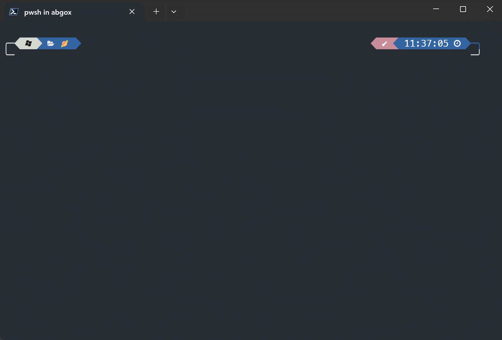

# 👉[PSCompletions —— A better way to manage completions](https://github.com/abgox/PSCompletions 'PSCompletions')👈

[](https://github.com/abgox/PS-completions/blob/main/LICENSE)
[](https://img.shields.io/github/languages/code-size/abgox/PS-completions.svg)
[](https://img.shields.io/github/repo-size/abgox/PS-completions.svg)

<p align="left">
<a href="README.md">English</a> |
<a href="README-CN.md">简体中文</a> |
<a href="https://github.com/abgox/PS-completions">Github</a> |
<a href="https://gitee.com/abgox/PS-completions">Gitee</a>
</p>

# Some command completion in PowerShell

## How to use them(eg: `scoop-tab-completion`)

### How to install

1. Run PowerShell as Administrator.

2. Execute the following command:

    ```pwsh
    Install-Module scoop-tab-completion
    ```

3. Restart PowerShell and run:

    ```pwsh
    Import-Module scoop-tab-completion
    ```

    or simply:

    ```pwsh
    echo "Import-Module scoop-tab-completion" >> $PROFILE
    ```

    so you don't have to import the module every time you open PowerShell.

### How to uninstall

1. Run PowerShell as Administrator.
2. Execute the following command:

    ```pwsh
    Uninstall-Module scoop-tab-completion
    ```

## Tip

-   It can also be used by `Windows PowerShell`
-   Setting the `Tab` completion menu in `$PROFILE` can provide a better experience
    -   `echo "Set-PSReadLineKeyHandler -Key 'Tab' -Function MenuComplete" >> $PROFILE`
-   The completion prompt language defaults to the system language unless `$tab_completion_language` is set.
    -   eg. `$tab_completion_language='zh-CN'`
    -   Currently available languages: `en-US` and `zh-CN`
        -   If the variable value which set is not within the available language range, default to use system language.
        -   If the system language is also not available, default to use `en-US`

## Demo


