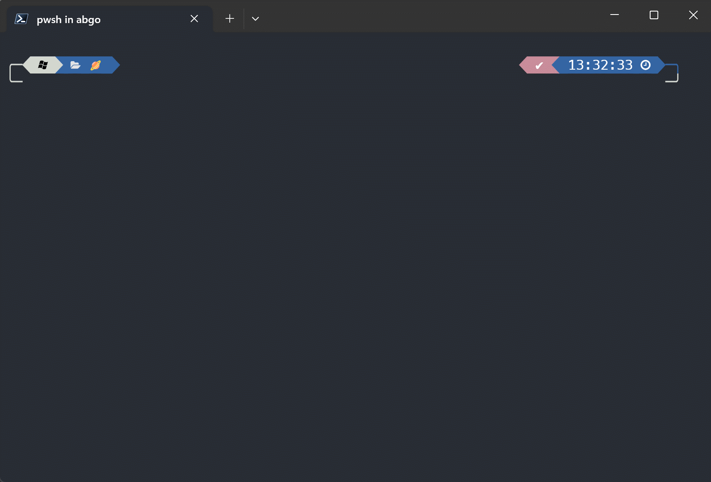
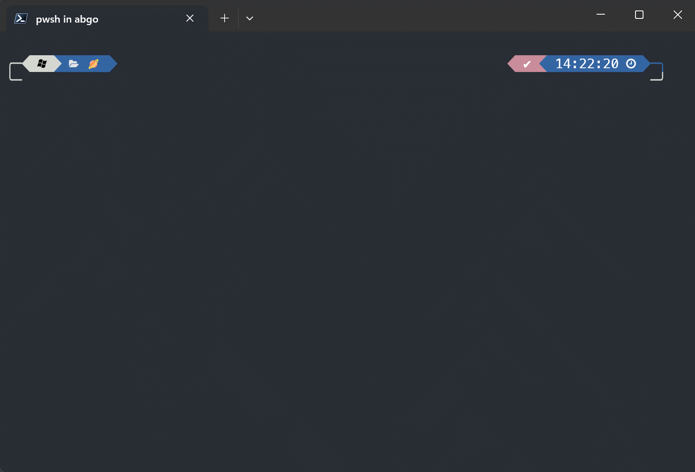

[](https://github.com/ivaquero/scoopet/blob/master/LICENSE)
[](https://img.shields.io/github/languages/code-size/abgox/PS-completions.svg)
[](https://img.shields.io/github/repo-size/abgox/PS-completions.svg)

<p align="left">
<a href="README.md">English</a> |
<a href="README-CN.md">简体中文</a>
</p>

# Some command completion in PowerShell

## How to use them(eg: `scoop-tab-completion`)
### How to install

1. Run PowerShell as Administrator.

2. Execute the following command:

    ```pwsh
    Install-Module scoop-tab-completion
    ```

3. Restart PowerShell and run:

    ```pwsh
    Import-Module scoop-tab-completion
    ```

    or simply:

    ```pwsh
    echo "Import-Module scoop-tab-completion" >> $profile
    ```

    so you don't have to import the module every time you open PowerShell.

### How to uninstall

1. Run PowerShell as Administrator.
2. Execute the following command:

    ```pwsh
    Uninstall-Module scoop-tab-completion
    ```


## Demo


